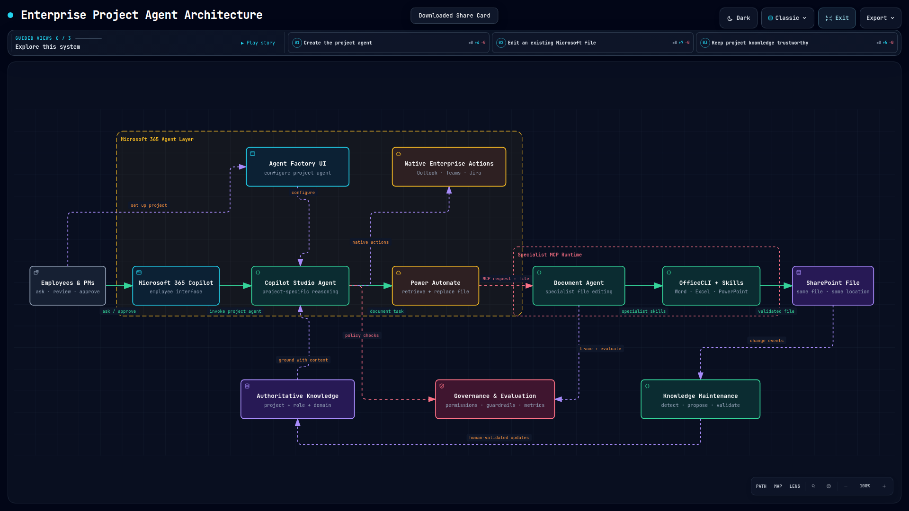

# Copilot Fleet

Copilot Fleet is an enterprise architecture for creating **project-level Microsoft Copilot agents** backed by authoritative organizational knowledge, native enterprise workflows, and reusable specialist capabilities exposed through MCP.

The objective is not to create a personality-based “Mini-Me” for every employee. The system models the capabilities the organization actually depends on: **project context, roles, domain expertise, permissions, skills, tools, and maintained knowledge**.



## Architecture at a Glance

```text
Employees & Project Managers
            ↓
Microsoft 365 Copilot
            ↓
Copilot Studio Project Agent
            ↓
Native tools / Power Automate / MCP
            ↓
Specialist Agent + Skills + OfficeCLI
            ↓
Enterprise systems and updated SharePoint files
```

> **Copilot Studio owns WHAT. Specialist MCP services own HOW.**

## Three Pillars

1. **Knowledge & Data Gathering** — capture authoritative project, role, domain, decision, and platform knowledge.
2. **Agent System & Creation** — create project agents in Copilot Studio and extend them through tools, workflows, connectors, and MCP specialist capabilities.
3. **Knowledge & Data Maintenance** — detect change, propose updates, and use human validation to keep the knowledge trustworthy.

## Start Here

| Resource | Description |
|---|---|
| [Executive Summary](docs/architecture/executive-summary.md) | Decision-level overview for leadership |
| [Full Enterprise Agent Architecture](docs/architecture/enterprise-agent-architecture.md) | Complete architecture document |
| [First Proof of Concept](docs/poc/first-proof-of-concept.md) | Recommended initial implementation and measurements |
| [Tools & Technologies](docs/architecture/tools-and-technologies.md) | Technology map and purpose |
| [Interactive Archify Diagram](artifacts/archify/enterprise-project-agent.architecture.html) | Self-contained interactive system map |
| [Archify Artifact Directory](artifacts/archify/README.md) | Source JSON, exports, checks, receipts, and portable package |
| [Formatted Word Document](docs/architecture/Enterprise_Agent_Architecture.docx) | Generated shareable DOCX version |

## Initial Implementation Direction

- **Microsoft 365 Copilot** — employee-facing entry point.
- **Microsoft Copilot Studio** — project agents, knowledge, instructions, triggers, and capability routing.
- **SharePoint** — initial authoritative knowledge and Office file system of record.
- **Power Automate / Agent Flows** — deterministic integration and file-transfer workflows.
- **MCP** — clean boundary for specialist capabilities.
- **Document Agent + OfficeCLI** — deep editing and validation of Word, Excel, and PowerPoint files.
- **Skills** — reusable domain expertise; preferred over additional sub-agent layers until evaluation proves another agent is needed.

## Reproducible Architecture Artifacts

The typed Archify source is committed at [`artifacts/archify/enterprise-project-agent.architecture.json`](artifacts/archify/enterprise-project-agent.architecture.json). GitHub Actions validates it with Archify and regenerates the interactive HTML, PNG/SVG exports, executive screenshot, visual and interaction checks, artifact receipt, DOCX, and portable ZIP.

## Repository Structure

```text
docs/
├── architecture/
│   ├── executive-summary.md
│   ├── enterprise-agent-architecture.md
│   ├── tools-and-technologies.md
│   └── Enterprise_Agent_Architecture.docx
└── poc/
    └── first-proof-of-concept.md

artifacts/
└── archify/
    ├── enterprise-project-agent.architecture.json
    ├── enterprise-project-agent.architecture.html
    ├── enterprise-project-agent.executive-1920x1080.png
    ├── enterprise-project-agent.diagram.png
    ├── enterprise-project-agent.diagram.svg
    ├── validation and verification receipts
    └── enterprise-project-agent-archify-package.zip
```
